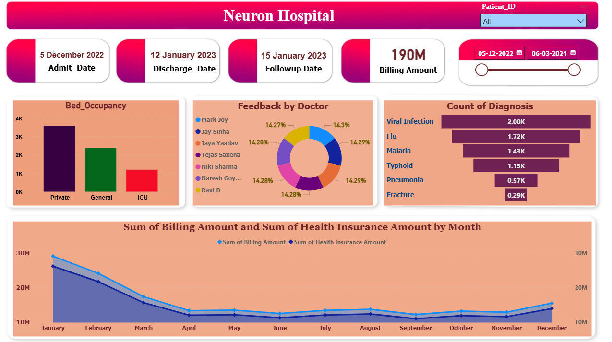

🏥 Neuron Hospital Power BI Dashboard

📊 Overview
The Neuron Hospital Dashboard is an interactive Power BI report designed to analyze hospital operations, patient data, and financial performance. It provides key insights into admissions, billing, diagnoses, and doctor feedback to support data-driven decision-making.

🚀 Features
📅 Patient Tracking:- Admission Date,Discharge Date,Follow-up Date
💰 Financial Insights:- Total Billing Amount: 190M,Monthly trends of:,Billing Amount,Health Insurance Amount
🛏️ Bed Occupancy Analysis:- Private Beds,General Beds,ICU Beds
👨‍⚕️ Doctor Feedback:- Visual representation of feedback distribution by doctors
🦠 Diagnosis Insights:- Count of diseases such as:Viral Infection,Flu,Malaria,Typhoid,Pneumonia,Fracture
🔍 Filters & Slicers:- Patient ID filter,Date range selector for dynamic analysis

📈 Dashboard Insights:-
Private beds have the highest occupancy compared to General and ICU.
Viral infections and Flu are the most common diagnoses.
Billing trends show a decline mid-year with gradual recovery towards year-end.
Health insurance claims closely follow billing patterns.

🛠️ Tools & Technologies:-
Power BI Desktop
Data Modeling
DAX (Data Analysis Expressions)
Data Visualization Techniques

Screenshot/Demos:- .(https://github.com/Aniket3687/Hospital-Dashboard/blob/main/Hospital%20Dashboard.png).
Example: 
